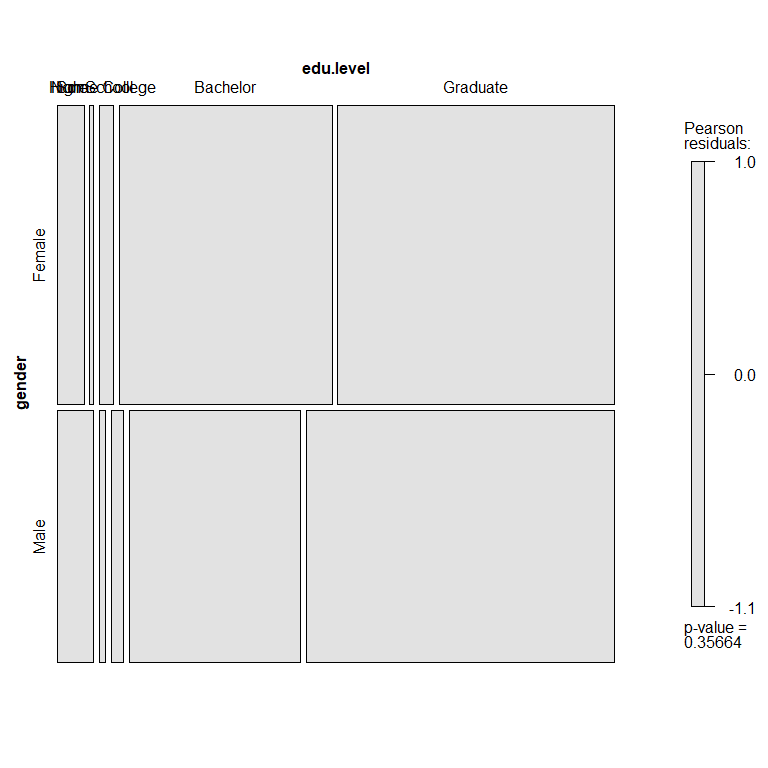
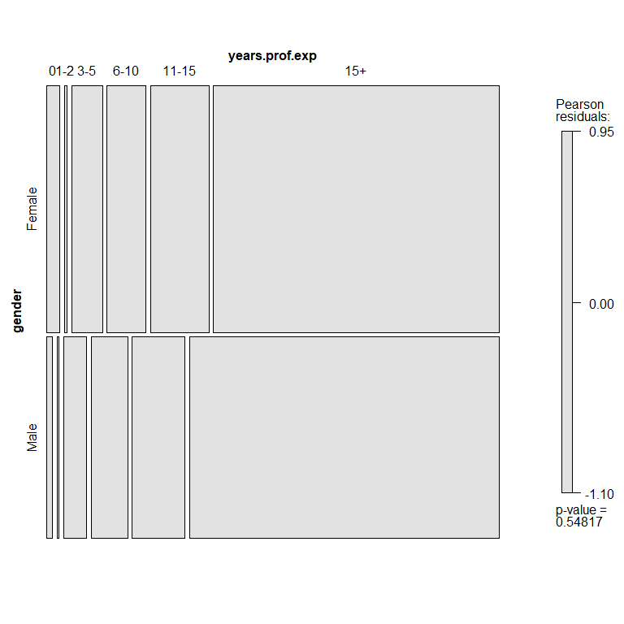
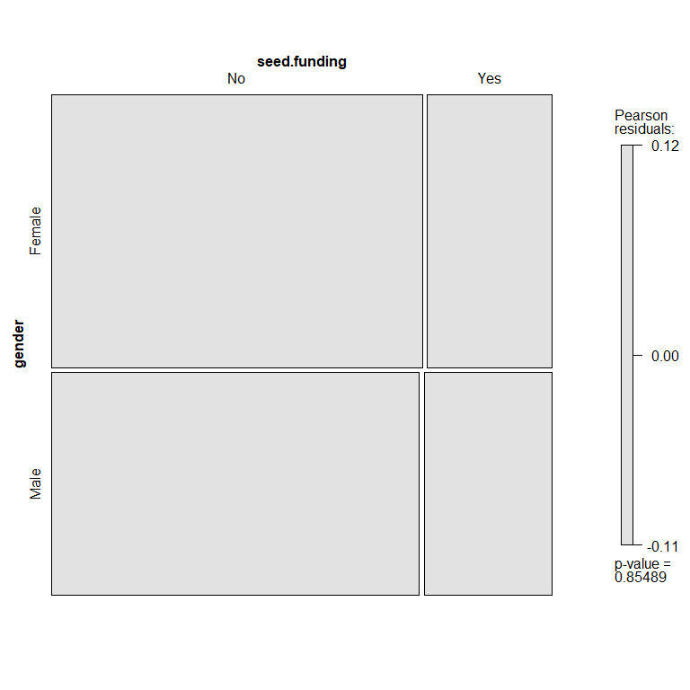
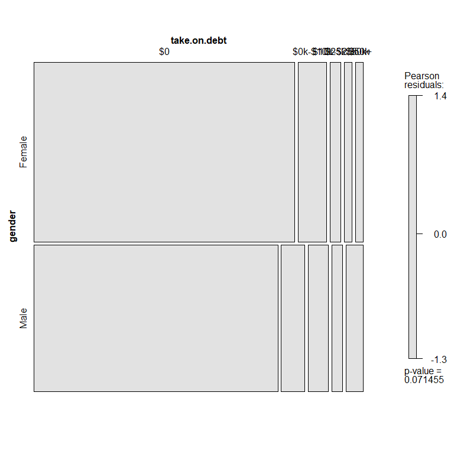
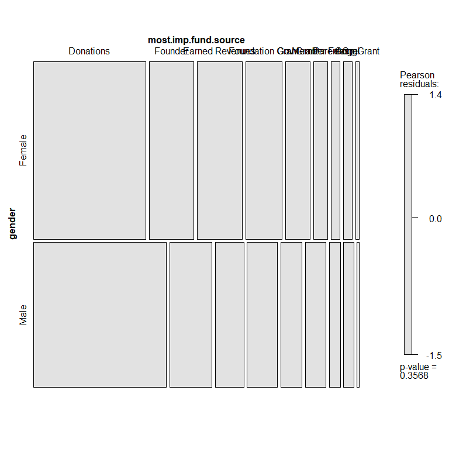
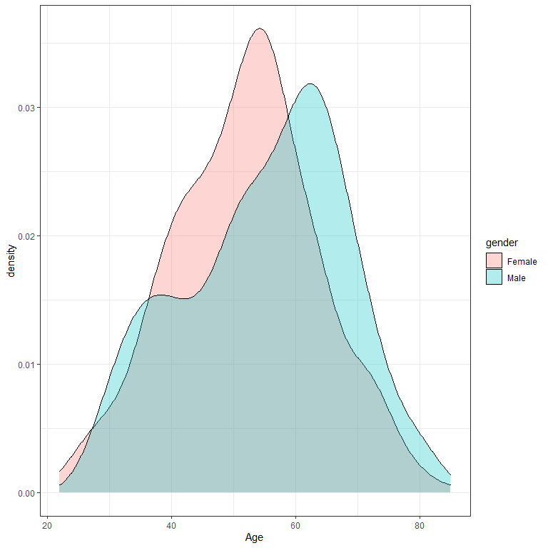
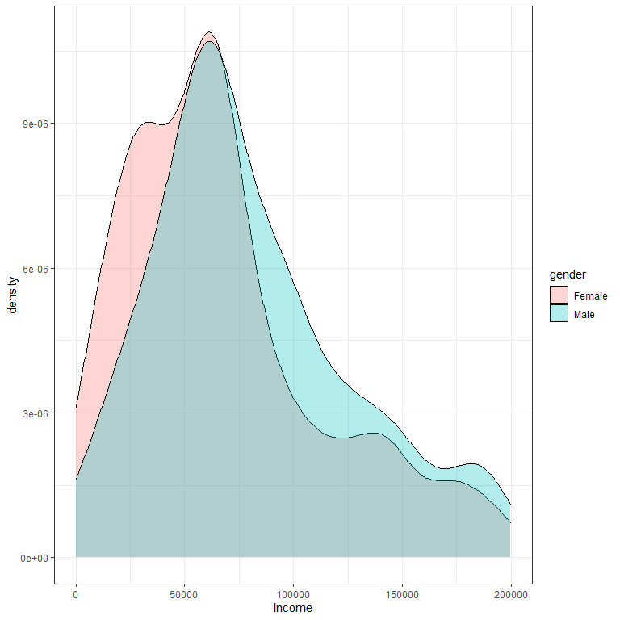

---
output:
  html_document:
    keep_md: true 
    theme: readable
    highlight: tango
    toc: yes
---


# Lab 02 - Equivalence Tests 

**Rudy Meza**

---------------
 
**Packages**


```r
library( dplyr )
library( pander )
library( ggplot2 )
library(tidyverse)
```

**Data**


```r
# load lab data
URL <- "https://github.com/DS4PS/cpp-524-sum-2020/blob/master/labs/data/female-np-entrepreneurs.rds?raw=true"
dat <- readRDS(gzcon(url( URL )))
head( dat )
```

```
##   gender age income edu.level years.prof.exp experience.np.create
## 1 Female  54  79669  Graduate          11-15                   No
## 2 Female  62  63474  Graduate            15+                   No
## 3 Female  70  27887  Graduate            15+                  Yes
## 4   Male  63  63474  Graduate            15+                  Yes
## 5 Female  60 170832  Graduate            15+                  Yes
## 6 Female  41  69531  Graduate           6-10                  Yes
##   experience.np.form experience.np.other take.on.debt seed.funding
## 1                 No                 Yes           $0           No
## 2                Yes                 Yes           $0           No
## 3                Yes                 Yes           $0           No
## 4                 No                 Yes           $0           No
## 5                Yes                 Yes           $0          Yes
## 6                 No                  No           $0          Yes
##   most.imp.fund.source
## 1            Donations
## 2            Gov Grant
## 3            Donations
## 4            Donations
## 5           Corp Grant
## 6            Gov Grant
```


# QUESTIONS


## Question 1 

Compare education levels of male and female entrepreneurs.

* Variable Name: **edu.level** 
* Variable Type: **factor**
* Survey question: *What is the highest level of education you have achieved?*


```r
m<-dat%>%
  select(gender, edu.level)
table(m)%>%pander() 
```


----------------------------------------------------------------------
   &nbsp;     None   High School   Some College   Bachelor   Graduate 
------------ ------ ------------- -------------- ---------- ----------
 **Female**    15         2             8           120        156    

  **Male**     17         3             6            81        146    
----------------------------------------------------------------------

```r
new_m<-table(m)
```


```r
apply(table(m), MARGIN=2, FUN=sum )%>%pander()
```


---------------------------------------------------------
 None   High School   Some College   Bachelor   Graduate 
------ ------------- -------------- ---------- ----------
  32         5             14          201        302    
---------------------------------------------------------

```r
(apply(table(m), MARGIN=2, FUN=sum )/sum(new_m)) %>% round(2)%>%pander()
```


---------------------------------------------------------
 None   High School   Some College   Bachelor   Graduate 
------ ------------- -------------- ---------- ----------
 0.06      0.01           0.03         0.36       0.55   
---------------------------------------------------------

```r
new_m%>% prop.table( margin=1 ) %>% round(2)%>%pander()
```


----------------------------------------------------------------------
   &nbsp;     None   High School   Some College   Bachelor   Graduate 
------------ ------ ------------- -------------- ---------- ----------
 **Female**   0.05      0.01           0.03         0.4        0.52   

  **Male**    0.07      0.01           0.02         0.32       0.58   
----------------------------------------------------------------------


```r
vcd::mosaic( new_m, shade=TRUE, legend=TRUE )
```

<!-- -->

```r
chisq.test( new_m )
```

```
## 
## 	Pearson's Chi-squared test
## 
## data:  new_m
## X-squared = 4.3831, df = 4, p-value = 0.3566
```


### **ANSWER:** 

Explanation: comparing education levels of male and female entrepreneurs shows no differences.

The Chi-Square Test Fails to reject the null hypothesis at **0.3566** that the two factors are indeed independent of each other. 

We can also confirm this visually with the mosaic test plot: We can see Males and Females do match the population closely considering each row is "Grey". Also, the p-value matches the Chi-Square.


## Question 2 

Compare work experience for male and female entrepreneurs.

* Variable Name: **years.prof.exp** 
* Variable Type: **factor**
* Survey question: *How many years of professional experience did you have prior to starting the nonprofit?*


```r
m<-dat%>%
  select(gender, years.prof.exp)
table(m)%>%pander() 
```


--------------------------------------------------
   &nbsp;     0    1-2   3-5   6-10   11-15   15+ 
------------ ---- ----- ----- ------ ------- -----
 **Female**   11    2    26     33     49     241 

  **Male**    4     1    16     25     36     213 
--------------------------------------------------

```r
new_m<-table(m)
```


```r
apply(table(m), MARGIN=2, FUN=sum )%>%pander()
```


-------------------------------------
 0    1-2   3-5   6-10   11-15   15+ 
---- ----- ----- ------ ------- -----
 15    3    42     58     85     454 
-------------------------------------

```r
(apply(table(m), MARGIN=2, FUN=sum )/sum(new_m)) %>% round(2)%>%pander()
```


-----------------------------------------
  0     1-2   3-5    6-10   11-15   15+  
------ ----- ------ ------ ------- ------
 0.02    0    0.06   0.09   0.13    0.69 
-----------------------------------------

```r
new_m%>% prop.table( margin=1 ) %>% round(2)%>%pander()
```


-------------------------------------------------------
   &nbsp;      0     1-2    3-5    6-10   11-15   15+  
------------ ------ ------ ------ ------ ------- ------
 **Female**   0.03   0.01   0.07   0.09   0.14    0.67 

  **Male**    0.01    0     0.05   0.08   0.12    0.72 
-------------------------------------------------------


```r
vcd::mosaic( new_m, shade=TRUE, legend=TRUE )
```

<!-- -->

```r
chisq.test( new_m )
```

```
## 
## 	Pearson's Chi-squared test
## 
## data:  new_m
## X-squared = 4.0086, df = 5, p-value = 0.5482
```


### **ANSWER:** 

Explanation: comparing Years of Professional Experience between  Males and Females Shows no relationship exist.

The Chi-Square Test Fails to reject the null hypothesis at **0.5482** that the two factors are indeed independent of each other. 

We can also confirm this visually with the mosaic test plot: We can see Males and Females do match the population closely considering each row is "Grey". Also, the p-value matches the Chi-Square.


## Question 3 

Compare success in accessing seed funding for male and female entrepreneurs.

* Variable Name: **seed.funding** 
* Variable Type: **factor** 
* Survey question: *Did you receive any SEED FUNDING to start the organization? Seed funding supports development of the organization without requiring deliverables or program activities. Seed funding could also include funding for pilot programs.*


```r
m<-dat%>%
  select(gender, seed.funding)
table(m)%>%pander() 
```


------------------------
   &nbsp;     No    Yes 
------------ ----- -----
 **Female**   271   91  

  **Male**    219   76  
------------------------

```r
new_m<-table(m)
```


```r
apply(table(m), MARGIN=2, FUN=sum )%>%pander()
```


-----------
 No    Yes 
----- -----
 490   167 
-----------

```r
(apply(table(m), MARGIN=2, FUN=sum )/sum(new_m)) %>% round(2)%>%pander()
```


-------------
  No    Yes  
------ ------
 0.75   0.25 
-------------

```r
new_m%>% prop.table( margin=1 ) %>% round(2)%>%pander()
```


--------------------------
   &nbsp;      No    Yes  
------------ ------ ------
 **Female**   0.75   0.25 

  **Male**    0.74   0.26 
--------------------------


```r
vcd::mosaic( new_m, shade=TRUE, legend=TRUE )
```

<!-- -->

```r
chisq.test( new_m )
```

```
## 
## 	Pearson's Chi-squared test with Yates' continuity correction
## 
## data:  new_m
## X-squared = 0.0086147, df = 1, p-value = 0.9261
```

### **ANSWER:** 

Explanation: comparing success in accessing seed funding between  Males and Females Shows no relationship exist.

The Chi-Square Test Fails to reject the null hypothesis at **0.9261** that the two factors are indeed independent of each other. 

We can also confirm this visually with the mosaic test plot: We can see Males and Females do match the population closely considering each row is "Grey". Also, the p-value matches the Chi-Square.


## Question 4 

Compare the willingness to take on personal debt for male and female entrepreneurs. 

* Variable Name: **take.on.debt** 
* Variable Type: **factor** 
* Survey question: *Have any members of the organization taken on debt to finance the organization? Collectively:*


```r
m<-dat%>%
  select(gender, take.on.debt)
table(m)%>%pander() 
```


-------------------------------------------------------------
   &nbsp;     $0    $0k-$10k   $10k-$25k   $25k-$50k   $50k+ 
------------ ----- ---------- ----------- ----------- -------
 **Female**   299      33         12           9         9   

  **Male**    228      22         19          10        16   
-------------------------------------------------------------

```r
new_m<-table(m)
```


```r
apply(table(m), MARGIN=2, FUN=sum )%>%pander()
```


------------------------------------------------
 $0    $0k-$10k   $10k-$25k   $25k-$50k   $50k+ 
----- ---------- ----------- ----------- -------
 527      55         31          19        25   
------------------------------------------------

```r
(apply(table(m), MARGIN=2, FUN=sum )/sum(new_m)) %>% round(2)%>%pander()
```


------------------------------------------------
 $0    $0k-$10k   $10k-$25k   $25k-$50k   $50k+ 
----- ---------- ----------- ----------- -------
 0.8     0.08       0.05        0.03      0.04  
------------------------------------------------

```r
new_m%>% prop.table( margin=1 ) %>% round(2)%>%pander()
```


--------------------------------------------------------------
   &nbsp;      $0    $0k-$10k   $10k-$25k   $25k-$50k   $50k+ 
------------ ------ ---------- ----------- ----------- -------
 **Female**   0.83     0.09       0.03        0.02      0.02  

  **Male**    0.77     0.07       0.06        0.03      0.05  
--------------------------------------------------------------


```r
vcd::mosaic( new_m, shade=TRUE, legend=TRUE )
```

<!-- -->

```r
chisq.test( new_m )
```

```
## 
## 	Pearson's Chi-squared test
## 
## data:  new_m
## X-squared = 8.6158, df = 4, p-value = 0.07145
```

### **ANSWER:** 

Explanation: willingness to take on personal debt between  Males and Females Shows no relationship exist.

The Chi-Square Test Fails to reject the null hypothesis at **0.07145** that the two factors are indeed independent of each other. However, this is marginally significant for rejecting the null hypothesis. 

We can also confirm this visually with the mosaic test plot: We can see Males and Females do match the population closely considering each row is "Grey". Also, the p-value matches the Chi-Square.


## Question 5 

Compare sources of first year funding for male and female entrepreneurs. 

* Variable Name: **most.imp.fund.source** 
* Variable Type: **factor** 
* Survey question: *From the list of funding sources, which has been the MOST important in your first year of operations? Choose one.*


```r
m<-dat%>%
  select(gender, most.imp.fund.source)
table(m)%>%pander() 
```


-----------------------------------------------------------------------
   &nbsp;     Donations   Founder   Earned Revenues   Foundation Grant 
------------ ----------- --------- ----------------- ------------------
 **Female**      136        54            55                 44        

  **Male**       131        42            28                 30        
-----------------------------------------------------------------------

Table: Table continues below

 
------------------------------------------------------------------------
   &nbsp;     Gov Grant   Member Fees   Parent Org   Angel   Corp Grant 
------------ ----------- ------------- ------------ ------- ------------
 **Female**      30           17            11        11         4      

  **Male**       21           20            11        10         2      
------------------------------------------------------------------------

```r
new_m<-table(m)
```


```r
apply(table(m), MARGIN=2, FUN=sum )%>%pander()
```


----------------------------------------------------------------------
 Donations   Founder   Earned Revenues   Foundation Grant   Gov Grant 
----------- --------- ----------------- ------------------ -----------
    267        96            83                 74             51     
----------------------------------------------------------------------

Table: Table continues below

 
-----------------------------------------------
 Member Fees   Parent Org   Angel   Corp Grant 
------------- ------------ ------- ------------
     37            22        21         6      
-----------------------------------------------

```r
(apply(table(m), MARGIN=2, FUN=sum )/sum(new_m)) %>% round(2)%>%pander()
```


----------------------------------------------------------------------
 Donations   Founder   Earned Revenues   Foundation Grant   Gov Grant 
----------- --------- ----------------- ------------------ -----------
   0.41       0.15          0.13               0.11           0.08    
----------------------------------------------------------------------

Table: Table continues below

 
-----------------------------------------------
 Member Fees   Parent Org   Angel   Corp Grant 
------------- ------------ ------- ------------
    0.06          0.03      0.03       0.01    
-----------------------------------------------

```r
new_m%>% prop.table( margin=1 ) %>% round(2)%>%pander()
```


-----------------------------------------------------------------------
   &nbsp;     Donations   Founder   Earned Revenues   Foundation Grant 
------------ ----------- --------- ----------------- ------------------
 **Female**     0.38       0.15          0.15               0.12       

  **Male**      0.44       0.14          0.09               0.1        
-----------------------------------------------------------------------

Table: Table continues below

 
------------------------------------------------------------------------
   &nbsp;     Gov Grant   Member Fees   Parent Org   Angel   Corp Grant 
------------ ----------- ------------- ------------ ------- ------------
 **Female**     0.08         0.05          0.03      0.03       0.01    

  **Male**      0.07         0.07          0.04      0.03       0.01    
------------------------------------------------------------------------


```r
vcd::mosaic( new_m, shade=TRUE, legend=TRUE )
```

<!-- -->

```r
chisq.test( new_m )
```

```
## 
## 	Pearson's Chi-squared test
## 
## data:  new_m
## X-squared = 8.8304, df = 8, p-value = 0.3568
```


### **ANSWER:** 

Explanation: comparing sources of first year funding between Males and Females Shows no relationship exist.

The Chi-Square Test Fails to reject the null hypothesis at **0.3568** that the two factors are indeed independent of each other. 

We can also confirm this visually with the mosaic test plot: We can see Males and Females do match the population closely considering each row is "Grey". Also, the p-value matches the Chi-Square.


## Question 6 

Compare age at the time of nonprofit formation for male and female entrepreneurs. 

* Variable Name: **age** 
* Variable Type: **numeric** 
* Survey question: *What was your age when you created the nonprofit?*


```r
m<-dat%>%
  select(gender, age)
  
by(m,m$gender,summary)%>%pander()
```


  * **Female**:

    ----------------------------
       gender          age
    ------------ ---------------
     Female:362   Min.  :22.00

      Male : 0    1st Qu.:44.00

         NA       Median :52.00

         NA        Mean :51.94

         NA       3rd Qu.:59.50

         NA       Max.  :85.00

         NA         NA's :15
    ----------------------------

  * **Male**:

    ---------------------------
      gender          age
    ----------- ---------------
     Female: 0   Min.  :29.00

     Male :295   1st Qu.:45.25

        NA       Median :57.00

        NA        Mean :55.05

        NA       3rd Qu.:64.75

        NA       Max.  :82.00

        NA          NA's :5
    ---------------------------


<!-- end of list -->


```r
ggplot(m,aes(age, fill=gender))+
  geom_density(alpha=0.3)+
  xlab("Age")+
  theme_bw()
```

<!-- -->


```r
t.test( age ~ gender, data=m )
```

```
## 
## 	Welch Two Sample t-test
## 
## data:  age by gender
## t = -3.1749, df = 589.02, p-value = 0.001577
## alternative hypothesis: true difference in means between group Female and group Male is not equal to 0
## 95 percent confidence interval:
##  -5.031881 -1.185709
## sample estimates:
## mean in group Female   mean in group Male 
##             51.93948             55.04828
```

### **ANSWER:** 

Explanation: The p-value of the t-test less than **0.05**

Therefore, Age at the time the non-profit was formed for males and females is equivalent.


## Question 7 

Compare income levels prior to starting the nonprofit for male and female entrepreneurs. 

* Variable Name: **income** 
* Variable Type: **numeric** 
* Survey question: *Please specify your income range prior to working to create this nonprofit:*


```r
m<-dat%>%
  select(gender, income)
  
by(m,m$gender,summary)%>%pander()
```


  * **Female**:

    -----------------------------
       gender         income
    ------------ ----------------
     Female:362     Min.  : 81

      Male : 0    1st Qu.: 33139

         NA       Median : 61113

         NA        Mean : 67742

         NA       3rd Qu.: 86094

         NA       Max.  :199147
    -----------------------------

  * **Male**:

    ----------------------------
      gender         income
    ----------- ----------------
     Female: 0    Min.  : 1026

     Male :295   1st Qu.: 49437

        NA       Median : 69351

        NA        Mean : 80883

        NA       3rd Qu.:107363

        NA       Max.  :199684
    ----------------------------


<!-- end of list -->


```r
ggplot(m,aes(income, fill=gender))+
  geom_density(alpha=0.3)+
  xlab("Income")+
  theme_bw()
```

<!-- -->


```r
t.test( income ~ gender, data=m )
```

```
## 
## 	Welch Two Sample t-test
## 
## data:  income by gender
## t = -3.6353, df = 630.22, p-value = 0.0003003
## alternative hypothesis: true difference in means between group Female and group Male is not equal to 0
## 95 percent confidence interval:
##  -20239.710  -6042.518
## sample estimates:
## mean in group Female   mean in group Male 
##             67741.83             80882.95
```

### **ANSWER:** 

Explanation: The p-value of the t-test less than **0.05**

Therefore, income levels prior to starting the nonprofit between males and females is equivalent.

## Question 8

Based upon these seven contrasts, would you conclude that the resources male and female nonprofit entrepreneurs have at the time of founding were equivalent?

No, based on the last seven contrasts, two were found to show equivalence between men and women. Therefore, the differences are more likely to be driven by unmeasured behavioral traits.

**Q8-A:**

What is the adjusted decision criteria used for contrasts to maintain an alpha of 0.05 for the omnibus test of group equivalence? 

### **ANSWER:** 


```r
adjusted_alpha<-0.05/7
adjusted_alpha
```

```
## [1] 0.007142857
```

The adjusted decision criteria: **0.007142857**


**Q8-B:**

What is the lowest p-value you observed across the seven contrasts? 

### **ANSWER:** 

 p-value = 0.0003003


**Q8-C:**

Can we claim study group equivalency? Why or why not? 

### **ANSWER:** 

No, based on the the new adjusted alpha. We still have a failure of two tests. Therefore, we can not claim study group equivalency.

